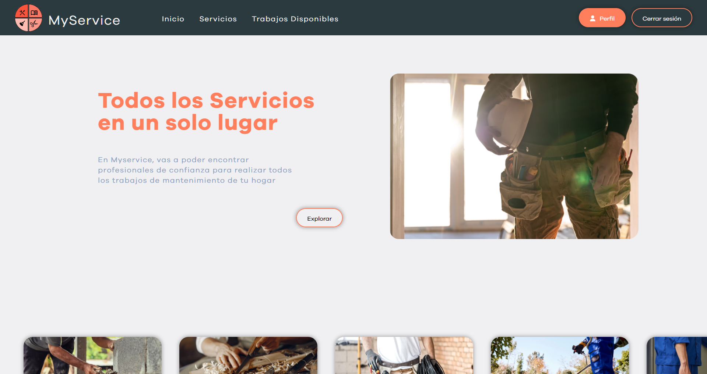

# My Service - Grupo C11-05-T-Javareact

  

## Descripción del Proyecto

MyService es una plataforma para clientes con algún problema que resolver (plomería, carpintería, …) y expertos que les ayudan solucionar esos problemas.

## Stack Tecnologias

### Front-End:

- HTML
- CSS
- JavaScript
- React
- Redux Toolkit Query
- TailwindCSS
- Framer Motion
- React Hook
- SweetAlert

### Back-End:

- Java 17
- Springboot
- Spring security 6.0
- Spring data
- MySQL

### Diseño y Organización:

- Figma
- Trello
- Discord

### Deploy:

- Vercel
- Railway

## Integrantes del equipo:

### UX/UI:

  
Manuel Quiroga Laspiur:

  
    <a href="https://www.linkedin.com/in/manuelquirogalaspiur/">Linkedin,</a>
  

### Front-End:

  
Elian Cueva Coronel:

  
    <a href="https://www.linkedin.com/in/elian-cueva-coronel/">Linkedin,</a>
  
  
    <a href="https://github.com/ElianCue">Github,</a>
  
  
    <a href="https://eliancue.github.io/portfolio-elian-cueva-coronel/">Portfolio.</a>
  

 

  
Abel Alejandro Acuña:

  
    <a href="https://www.linkedin.com/in/abel-acu%C3%B1a-roninwebdesign">Linkedin,</a>
  
  
    <a href="https://github.com/Ronin-21">Github,</a>
  
  
    <a href="https://ronin-webdesign.vercel.app/">Portfolio.</a>
  

### Back-End:

  
Erik Jose:

  
    <a href="https://www.linkedin.com/in/erik-jose-73365291">Linkedin,</a>
  
  
    <a href="https://github.com/Erik1935">Github.</a>
  

### Testing:

  
Bruno Gentile:

  
    <a href="https://www.linkedin.com/in/brunoagustingentile/">Linkedin,</a>
  
  
    <a href="https://github.com/BrunoGentile">Github.</a>
  

 

  

 
### **Puedes ver la Demostración del proyecto [Aqui]( https://my-service.vercel.app/).**

## Plan de pruebas.

Puedes encontrar el plan de pruebas en el siguiente enlace: [Plan de pruebas](https://docs.google.com/document/d/1m_wGnOlNRf0Ji0UmxXDsZKhvCIoV97LPRQI9KBVM3xw/edit#)

## Historias de Usuario.

Las historias de usuario se encuentran en el siguiente enlace: [Historias de Usuario](https://docs.google.com/document/d/1n1h53vlgCHGZE_w3it7UCP29qkhdZNpfIgq7nsFObZM/edit)

## Test Suite Login/Registro.

Puedes acceder a la Test Suite del módulo de Login/Registro en el siguiente enlace: [Test Suite Login/Registro](https://docs.google.com/spreadsheets/d/1djmwBgjPIe0Dk9X23-fqPCdjkadD726qjhP-hAicfXI/edit#gid=0)

## Test Suite Home.

Puedes acceder a la Test Suite del módulo Home en el siguiente enlace: [Test Suite Home](https://docs.google.com/spreadsheets/d/1GNkNpS79ELdxCv8L-Y_rQ_eLR8R0VLyi5F1AwMuFQBo/edit#gid=0)

## Test Suite Trabajos Disponibles.

Puedes acceder a la Test Suite del módulo Trabajos Disponibles en el siguiente enlace: [Test Suite Trabajos Disponibles](https://docs.google.com/spreadsheets/d/17H72dLb8poapprFYiDYSShr-IOGx4t7qSnx6dsXgxYk/edit#gid=0)

## Test Suite Cuenta/Perfil de profesional.

Puedes acceder a la Test Suite del módulo Formulario Solicitar Presupuesto en el siguiente enlace: [Test Suite Formulario Servicios](https://docs.google.com/spreadsheets/d/1ZQ11CJHAT3w1vsaaVfJhbuINT-7xt_a2j0TIMGYEmp0/edit#gid=0)

## Test Suite Cuenta/Perfil de Usuario.

Puedes acceder a la Test Suite del módulo Cuenta/Perfil de Usuario en el siguiente enlace: [Test Suite Cuenta/Perfil de Usuario](https://docs.google.com/spreadsheets/d/1DkMaofLZ2FdKjTmEieHIxpmKgZF2Ouig6juPOhs4e5Q/edit#gid=0)

## Reporte de Testing

Puedes acceder al Reporte de Testing y al Checklist de los Casos de Prueba en los siguientes enlaces:
[Reporte de Testing](https://docs.google.com/document/d/10N1rJNgatR-KrgQvSfhjkUSgAQ_8gbch1O2WxQlbZMM/edit) <-> [CheckList](https://docs.google.com/spreadsheets/d/1PaC68oXyIzFpxzCEUPAZCaWzDPqECyTpS0ZDFWB46-Q/edit#gid=0)
